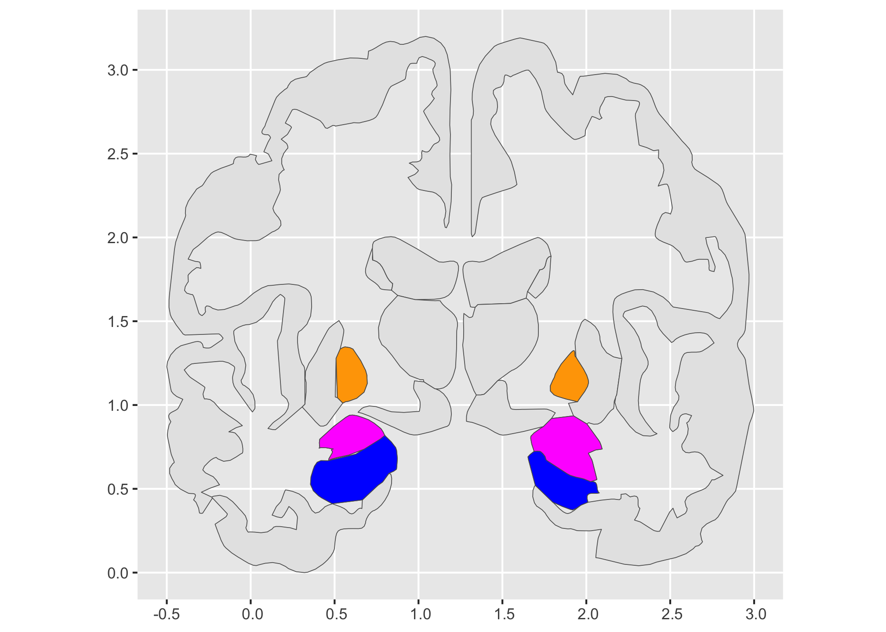
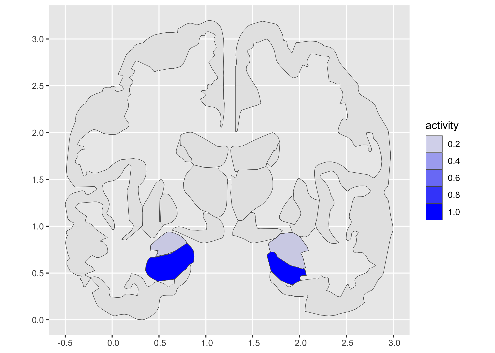

# ggnut

This fork of the {ggseg} project uses `ggregions` to create layers
(annotation layers ‘stamp’, and mapped geom\_\*s). It uses
[ggseg](https://ggseg.github.io/ggseg/) data - a well thought out and
maintained project: see the [Advances in Methods and Practices in
Psychological
Science](https://journals.sagepub.com/doi/10.1177/2515245920928009)
paper.

The ggnut user is expected to have little clue about the brain, (might
confuse a [walnut](https://en.wikipedia.org/wiki/Walnut) for a brain).
With ggnut, brain region newcomers might able to orient themselves to
some brain regions, that they might have heard discussed in the media,
for example, couldn’t say where they reside in the brain, looking just
at the aseg brain atlas, and coronal view (the ggseg project encompass
many more atlas and their regions).

Thinking about mapping brain regions was a very motivating case for
ggregions, however it’s not too clear that it makes a good usecase
(still hopeful that it can be useful in geo context 🤞🤞
<https://github.com/EvaMaeRey/ggusmap> or maybe less amorphous regions -
looking for a teeth atlas!)

# Getting started…

Meeting the assumptions/naivite of the ggregions package. I’ve only used
ggregions with simple 1-1 relationships, region name \<-\> region

``` r
library(ggregions)
library(ggplot2)
library(dplyr)

ggseg::aseg$data
#> Simple feature collection with 29 features and 4 fields
#> Geometry type: MULTIPOLYGON
#> Dimension:     XY
#> Bounding box:  xmin: -0.5 ymin: 0 xmax: 7.061358 ymax: 3.203063
#> CRS:           NA
#> # ggseg atlas
#>    hemi  region            side    label                                geometry
#>    <chr> <chr>             <chr>   <chr>                          <MULTIPOLYGON>
#>  1 right <NA>              coronal <NA>                (((2.07673 2.70275, 2.07…
#>  2 left  <NA>              coronal <NA>                (((0.50396 2.66412, 0.50…
#>  3 left  thalamus proper   coronal Left-Thalamus-Prop… (((1.03233 1.13797, 1.03…
#>  4 right thalamus proper   coronal Right-Thalamus-Pro… (((1.64163 1.63765, 1.65…
#>  5 right lateral ventricle coronal Right-Lateral-Vent… (((1.64163 1.63765, 1.63…
#>  6 left  hippocampus       coronal Left-Hippocampus    (((0.82329 0.59152, 0.82…
#>  7 left  lateral ventricle coronal Left-Lateral-Ventr… (((0.97903 1.62907, 0.97…
#>  8 right putamen           coronal Right-Putamen       (((2.21213 1.27837, 2.20…
#>  9 right amygdala          coronal Right-Amygdala      (((1.92373 0.93533, 1.93…
#> 10 left  putamen           coronal Left-Putamen        (((0.30664 0.98861, 0.30…
#> # ℹ 19 more rows
```

For better or worse, the 1-to-1 isn’t true of the atlas, so we use
`sf::st_combine()` and we just focus on one side.

``` r
coronal_ref_data <- ggseg::aseg$data |> 
  filter(side == "coronal") |>     # just look at coronal for the nuttiness.
  group_by(region) |> 
  summarise(geometry = sf::st_combine(geometry)) |> 
  select(region, everything())
  
coronal_ref_data |> pull(region)
#> [1] "amygdala"          "caudate"           "hippocampus"      
#> [4] "lateral ventricle" "pallidum"          "putamen"          
#> [7] "thalamus proper"   "ventral DC"        NA
```

Also, “nut” can refer to the head/brain in English in informal speech.

``` r
geom_seg <- write_geom_region_locale(ref_data = coronal_ref_data)
stamp_seg <- write_stamp_region_locale(ref_data = coronal_ref_data)
geom_seg_text <- write_geom_region_text_locale(ref_data = coronal_ref_data)
stamp_seg_text <- write_stamp_region_text_locale(ref_data = coronal_ref_data)

library(ggseg) # library ggnut - a ggseg derivitive...

ggplot() + 
  stamp_seg() + 
  stamp_seg(keep = "hippocampus", fill = "blue")
#> Coordinate system already present.
#> ℹ Adding new coordinate system, which will replace the existing one.
```


``` r

last_plot() + 
  stamp_seg(keep = "amygdala", fill = "magenta")
#> Coordinate system already present.
#> ℹ Adding new coordinate system, which will replace the existing one.
```


``` r

last_plot() + 
  stamp_seg(keep = "pallidum", fill = "orange")
#> Coordinate system already present.
#> ℹ Adding new coordinate system, which will replace the existing one.
```



Hmmm… below not working… Arg! puzzles - Oops it is working but, not
apparent when I had alpha showing activity w/ no color… Maybe should
change default fill of stamp v. geom in ggregions.

``` r
coronal_ref_data |> head()
#> Simple feature collection with 6 features and 1 field
#> Geometry type: MULTIPOLYGON
#> Dimension:     XY
#> Bounding box:  xmin: 0.30664 ymin: 0.37402 xmax: 2.21213 ymax: 2.00457
#> CRS:           NA
#> # A tibble: 6 × 2
#>   region                                                                geometry
#>   <chr>                                                           <MULTIPOLYGON>
#> 1 amygdala          (((1.92373 0.93533, 1.93033 0.93137, 1.99653 0.89127, 2.003…
#> 2 caudate           (((0.72747 1.86448, 0.73377 1.86329, 0.75194 1.85575, 0.770…
#> 3 hippocampus       (((0.82329 0.59152, 0.82025 0.58734, 0.78993 0.54558, 0.786…
#> 4 lateral ventricle (((1.64163 1.63765, 1.63383 1.63504, 1.55623 1.60883, 1.548…
#> 5 pallidum          (((0.50883 1.27848, 0.51084 1.28315, 0.53129 1.32971, 0.533…
#> 6 putamen           (((2.21213 1.27837, 2.20953 1.26015, 2.18353 1.07797, 2.180…

tribble(~region_name, ~activity,
        "hippocampus", 1,
        "amygdala", .2) |> 
  ggplot() + 
  aes(region = region_name,
      alpha = activity) +
  stamp_seg() +
  geom_seg(fill = "blue")
#> Coordinate system already present.
#> ℹ Adding new coordinate system, which will replace the existing one.
#> Joining with `by = join_by(region)`
```




